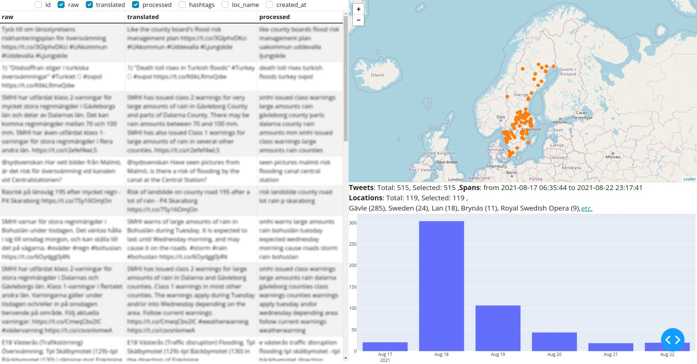

### Description

The project focuses on the following tasks:

- Extracting tweets related to floods
- Identifying geographical locations to the flood events
- Present the results using spatio-temporal plots.

### Setting up the environment

**Install python packages** with `pip` or any virtual environment using `requirements.txt`

**Install corpora** from spacy and nltk for NLP tasks `make install_corpora`

To **get the data** used, execute `dvc pull`. A web page will open that will require you
to get permission for the directory containing the data. You will have to wait
until I give you permission.

### Usage

To **train the flood classifier** `make train_flood_classifier`

The pipeline runs on AWS Sagemaker by default; to run it locally, use the
following:

`dvc exp run train --set-param 'datasets=${supervisor.processed}' --set-param 'env=${envs.locally}'`

To **show metrics for DVC experiments**: `make evaluation`

To use twitter's API, create `.env` to store the credentials with a similar format of `.env.template`.

To **run the pipeline** that extracts Swedish tweets from Twitter API between two dates, classify them, extract locations,
and show the visualization `make pipeline_from_api from="$FROM" to="$TO"`

### Examples

This is still a WIP in **visualization** branch.

The following an example of the using the pipeline on the flooding events in Gävleborg at 18th of August 2021 (1
week worth of tweets)

[Sweden – Flash Floods in Dalarna and Gävleborg After Record Rainfall – FloodList](https://floodlist.com/europe/central-sweden-floods-august-2021)

The following dash app shows the selected tweets in tabular, time series, and geographical representations.
The tweets are anonymized for privacy reasons. 

This a proof of concept for geographical representation using clusters and selection using different
levels regions (counties, municipalities)

