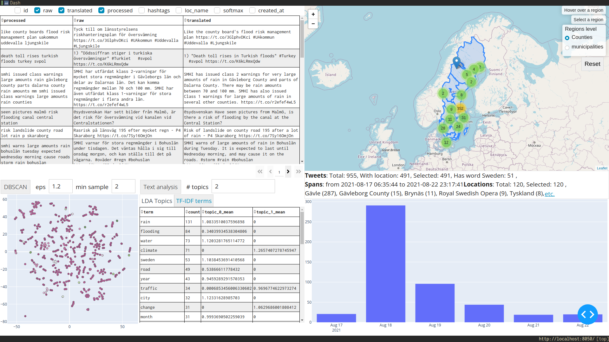

### Description

The project focuses on the following tasks:

- Extracting tweets related to floods
- Identifying geographical locations to the flood events
- Present the results using spatio-temporal plots.

### Setting up the environment

You will need python 3.10 

Install 3rd party packages using two options:
- `pip install .`
- virtual environment (recommended):
```bash
# Create virtual env
python -m venv .flood-classification-env
# Activate it
# On Linux
source flood-classification-env/bin/activate
# On Windows
# .flood-classification-env\Scripts\activate.bat
pip install .
```

**Install corpora** from spacy and nltk for NLP tasks

```bash
python -m spacy download en_core_web_sm
python -m spacy download sv_core_news_sm
python -m nltk.downloader omw-1.4 -d ./nltk_data
python -m nltk.downloader wordnet -d ./nltk_data

```

To **get the data and trained model** used, execute `dvc pull`. A web page will open that will require you
to get permission for the directory containing the data. You will have to wait
until I give you permission.

### Usage

To **train the flood classifier** `make train_flood_classifier`

The pipeline runs on AWS Sagemaker by default, To run it locally, use the following:

`dvc exp run train --set-param 'datasets=${supervisor.processed}' --set-param 'env=${envs.locally}'`

To **show metrics for DVC experiments**: `make evaluation`

To use twitter's API, create `.env` to store the credentials with a similar format of `.env.template`.

To **run the pipeline** that extracts Swedish tweets from Twitter API between two dates, classify them, extract locations,
and show the visualization `make pipeline_from_api from="$FROM" to="$TO"`


There are already processed datasets that can be used for the visual interface:

`python ./flood_detection/visualize/dash_app.py ./data/processed_geo/<dataset>`

E.g. Gavle's flood event (i.e. tweets between 2021-08-17 and 2021-08-23)

`python ./flood_detection/predict/predict_floods.py --dataset_path "./data/processed/twitter_api_2021-08-17_to_2021-08-23__2023-02-02_22:34:09.csv" `

There's a Dockerfile to test the visual interface for the dataset and open http://localhost:8050
(it takes around 20 seconds for the server to go up):

```bash
docker build -t flood_classification . -f docker/Dockerfile 
docker run -dp 8050:8050 flood_classification
 ```

### Visual interface

The dash app shows the selected tweets in interactive tabular, spatio-temporal representations with text
analysis.

The text analysis tabs shows the top average weighted terms from topics in LDA, and keywords in
TF-IDF. The scatter plot shows the TSNE with clusters generated using DBSCAN.

The following an example of the using the pipeline on the flooding events in Gävleborg at 18th of August 2021 (1
week worth of tweets)

[Sweden – Flash Floods in Dalarna and Gävleborg After Record Rainfall – FloodList](https://floodlist.com/europe/central-sweden-floods-august-2021)

Dash app:



Interactive plots:
Interactive selection on tweets can be done using clusters and locations (counties, municipalities), and histogram bars.

